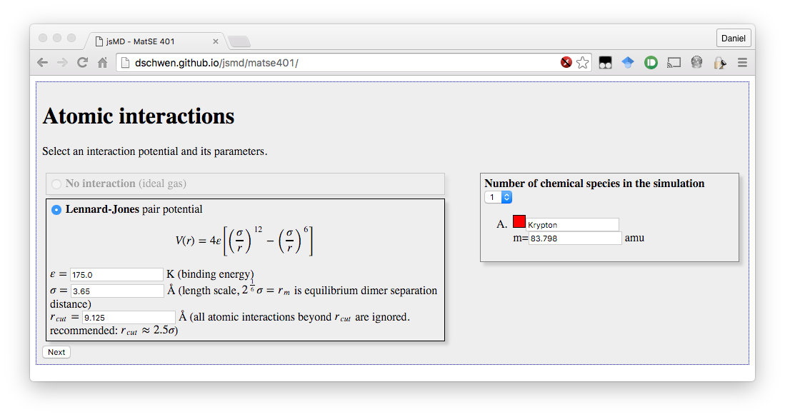
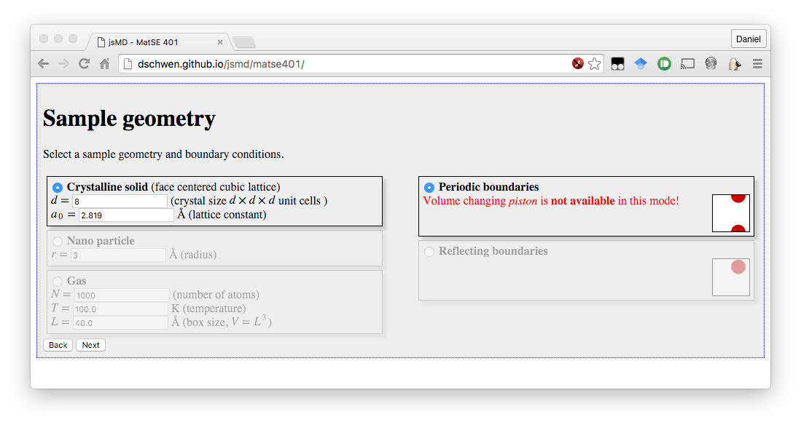
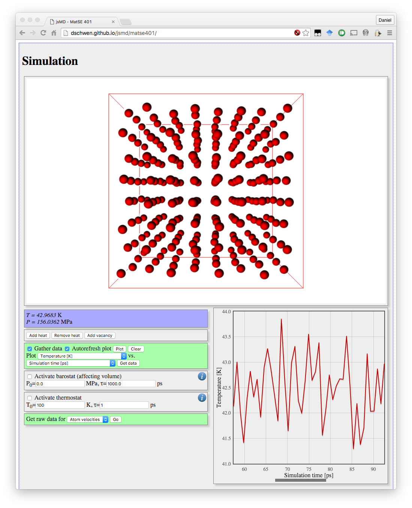

# JSMD

JSMD (JavaScript Molecular Dynamics) is an MD simulation, data, analysis, and visualization toolkit that runs in yoru browser. Its primary purpose is teaching the basic concepts of MD to undergrad and graduate students.

## [Click here to launch JSMD](http://dschwen.github.io/jsmd/matse401/)

